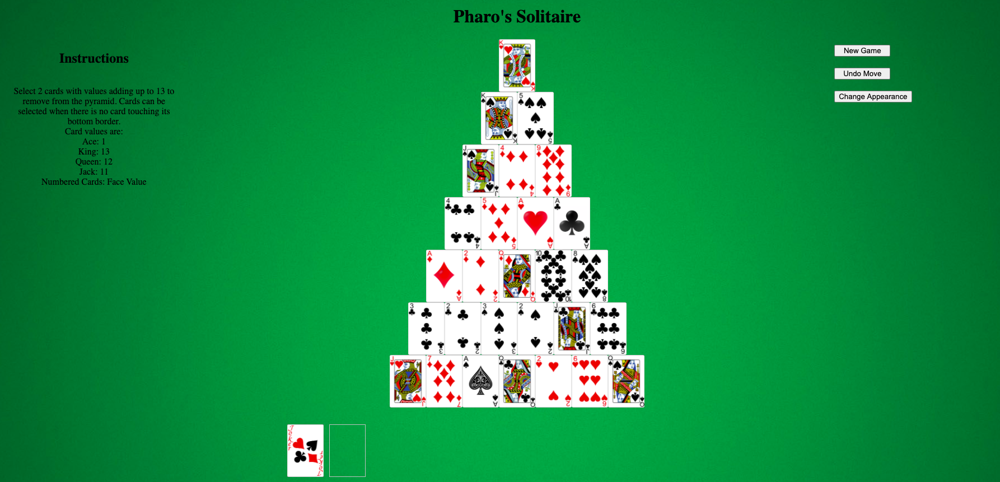
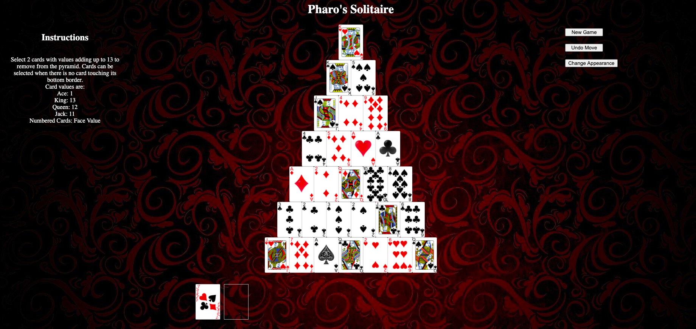

# Pharo's Solitaire
Pyramid Solitaire game

Game Link: [Pharo's Solitaire](https://nickl72.github.io/Pyramid-Solitaire/ "A Pyramid Solitaire Game")

## Project Description

### Gameplay

This is a web based pyramid solitare game. Cards are dealt onto the screen in a pyramid shape with 7 rows, each increasing in size by 1 card. The remaining cards will be flipped 1 at a time by a player to be available for matching. When a player clicks 2 available face up cards adding up to 13, those cards are removed from play. A player wins when they match all the cards on the table, and loses when no more moves are avilable.

### Features:

* Player card selections are highlighted
* Player can undo previous moves
* Using the change appearance button, players can choose from a selection of backgrounds
* Players can start a new game at any time

## Build Information

### Technology Used
* javascript: used for DOM manipulation
* html: used to render the game in the browser
* css: used to add styling to the game interface

### Wireframe:

### MVP: 

* Cards are dealt and shown to player in payramid shape (not overlapping). 
* One new card is shown when deck is clicked
* Selected cards appear differently
* When player clicks 2 flipped cards, both cards are removed from play.
* New game button restarts the game
* Game displays message when player wins
* game instructions are displayed

### Additional Completed Features

* Undo button steps back 1 turn with every iteration
* Players can choose from a variety of background designs

### Future Features:

* Cards at lower row of cards overlaps upper row of cards
* Players can choose from a library of card designs
* card motions are animated
* game has a numerical scoring system
* game ends when no more moves are available

## Project Challenges

* Styling that holds its position as elements are removed from the screen
* Creating undo function that reacts in 3 unique ways with a single function
* Unique functionality regarding the Kings i.e. removing/adding 1 card vs a pair
